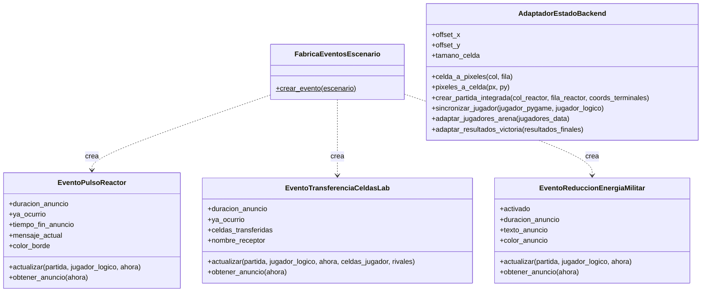

```mermaid
classDiagram
    class FabricaEventosEscenario {
        +crear_evento(escenario)$
    }

    class EventoPulsoReactor {
        +duracion_anuncio
        +ya_ocurrio
        +tiempo_fin_anuncio
        +mensaje_actual
        +color_borde
        +actualizar(partida, jugador_logico, ahora)
        +obtener_anuncio(ahora)
    }

    class EventoTransferenciaCeldasLab {
        +duracion_anuncio
        +ya_ocurrio
        +celdas_transferidas
        +nombre_receptor
        +actualizar(partida, jugador_logico, ahora, celdas_jugador, rivales)
        +obtener_anuncio(ahora)
    }

    class EventoReduccionEnergiaMilitar {
        +activado
        +duracion_anuncio
        +texto_anuncio
        +color_anuncio
        +actualizar(partida, jugador_logico, ahora)
        +obtener_anuncio(ahora)
    }

    class AdaptadorEstadoBackend {
        +offset_x
        +offset_y
        +tamano_celda
        +celda_a_pixeles(col, fila)
        +pixeles_a_celda(px, py)
        +crear_partida_integrada(col_reactor, fila_reactor, coords_terminales)
        +sincronizar_jugador(jugador_pygame, jugador_logico)
        +adaptar_jugadores_arena(jugadores_data)
        +adaptar_resultados_victoria(resultados_finales)
    }

    FabricaEventosEscenario ..> EventoPulsoReactor : crea
    FabricaEventosEscenario ..> EventoTransferenciaCeldasLab : crea
    FabricaEventosEscenario ..> EventoReduccionEnergiaMilitar : crea
```
